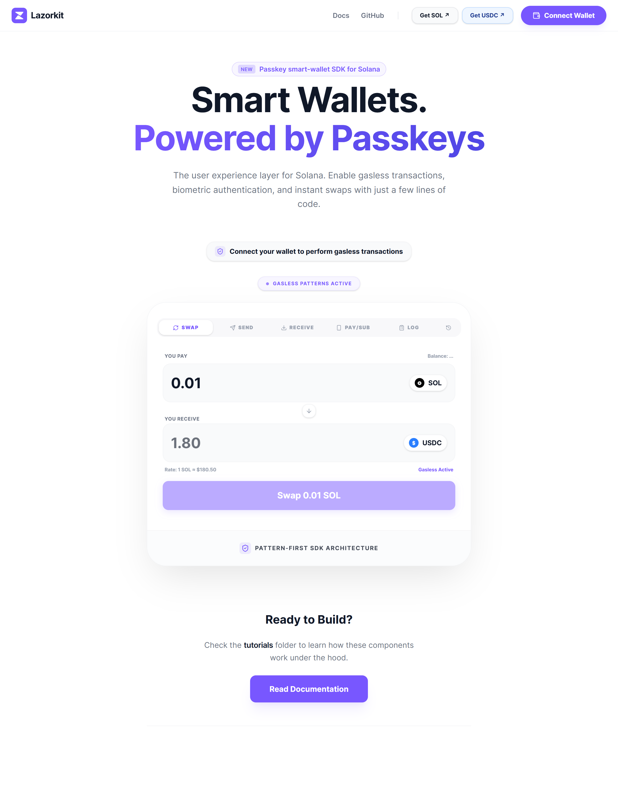
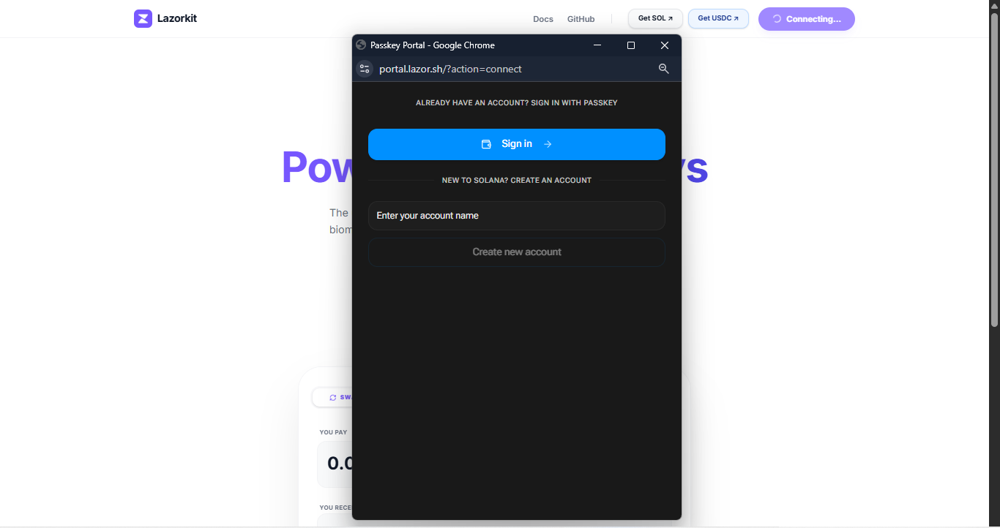
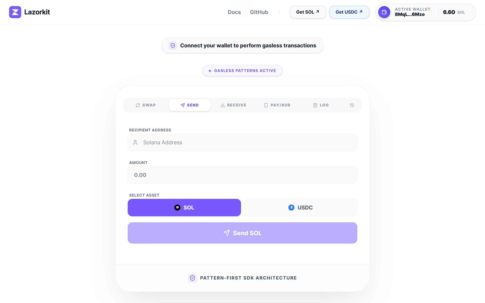
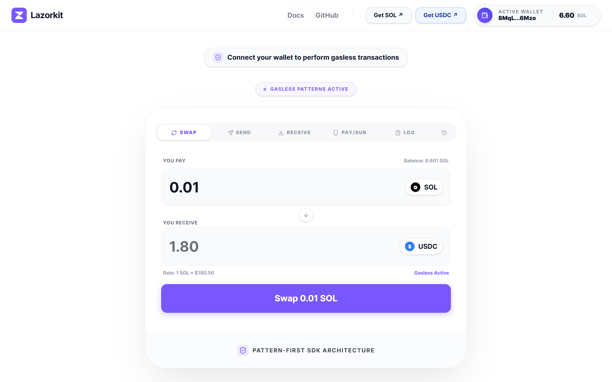
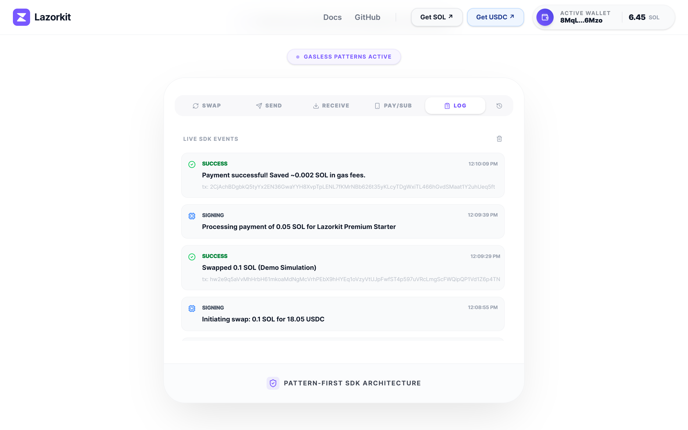
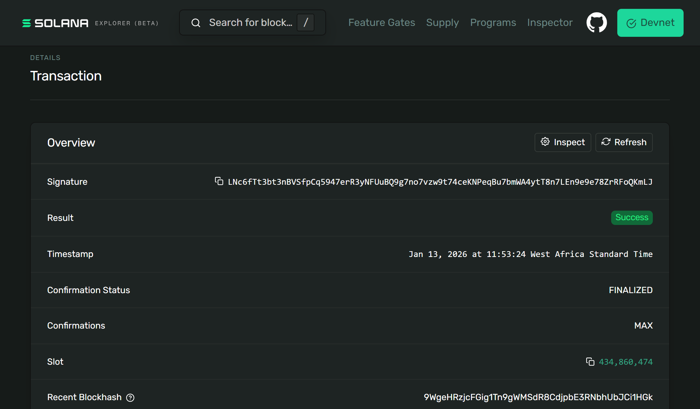
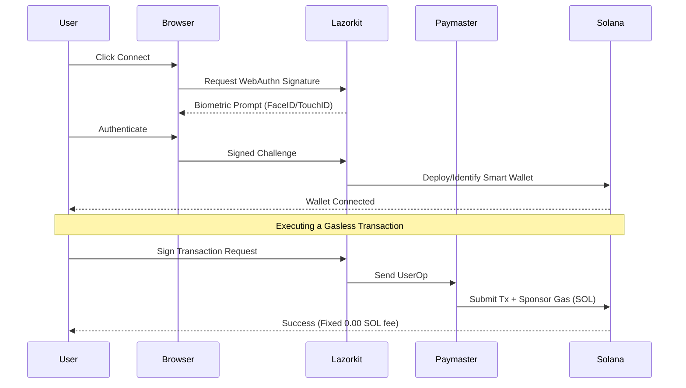

# Lazorkit Solana Starter (Next.js)

[](https://opensource.org/licenses/MIT)
[](https://nextjs.org/)
[](https://solana.com)

A production-ready starter template for building Solana applications with passkey authentication and gasless transactions using [Lazorkit](https://lazorkit.com).

## Live Demo

🌐 **Try it now:** [https://solanalazorkitstarter.vercel.app/]

**No installation required** - Test passkey auth and gasless transactions directly in your browser.

---

## Get Started in 60 Seconds

```bash
git clone https://github.com/YOUR-USERNAME/YOUR-REPO.git
cd YOUR-REPO
npm install
npm run dev
# Open http://localhost:3000
```

---

## What Makes This Different?

This starter demonstrates **real-world production patterns** that other templates skip:

1. **Real On-Chain USDC** - Not mocked. Uses actual Circle Devnet USDC (`4zMMC...`)
2. **Robust Balance Watching** - Multi-asset receive detection tracks both SOL and USDC transfers
3. **Wallet-Scoped Persistence** - LocalStorage keyed by wallet address prevents multi-wallet bugs
4. **Full Session Management** - Disconnect button with complete state cleanup
5. **Simulation Transparency** - Clear labeling distinguishes demo transactions from real ones

**Built for developers who need to ship production apps, not just demos.**

---

## Screenshots

### Dashboard Overview


_Premium landing page with clear value proposition and clean design_

### Passkey Authentication


_Biometric login using system passkey - no seed phrases or browser extensions required_

### Connect Wallet


_One-click connection with passkey authentication_

### Connected Wallet State


_Active wallet showing SOL and USDC balances with session management_

### Send Transaction (Gasless)


_Gasless SOL/USDC transfers - user pays 0 fees, Paymaster sponsors_

### Token Swap


_Bidirectional SOL ↔ USDC swaps (Demo Simulation labeled for transparency)_

### Transaction Activity Log


_Real-time multi-asset tracking with Solana Explorer links_

### Transaction History


_Comprehensive transaction history with status indicators_

### Gasless Proof (Solana Explorer)


_On-chain verification: Fee Payer is the Paymaster, not the user - true gasless confirmed_

### Payment & Subscription Demo


_Recurring payment pattern demonstration for SaaS models_

---

## Features

| Learning Pattern        | This Template       | Educational Value                       |
| ----------------------- | ------------------- | --------------------------------------- |
| **Bidirectional Swaps** | Full implementation | Master dynamic transaction construction |
| **Activity Timeline**   | Live event logging  | Understand UserOperation lifecycle      |
| **Feature Gating**      | Subscription hook   | Learn wallet-based access control       |
| **Multi-Asset Send**    | SOL + USDC          | Master SPL token patterns               |
| **Gasless Everywhere**  | All transactions    | True Web2 UX experience                 |

---

## Technical Architecture

We use a **hybrid security model** that combines hardware-level passkey signatures with non-custodial Smart Wallets.



**Key Innovation:** The Paymaster sponsors ALL transaction fees, enabling true zero-balance onboarding.

---

## Recommended Learning Path

**New to Lazorkit?** Follow this sequence to master passkey wallets and account abstraction:

### Step 1: Foundation - Passkey Authentication

**Start with:** `ConnectWallet.tsx`

- Learn how WebAuthn creates secure, password-less wallets.
- Understand the smart wallet creation and persistence flow.

### Step 2: Core Pattern - Gasless Multi-Asset Transfers

**Next:** `SendFund.tsx` → `ReceiveFund.tsx`

- Learn how paymasters sponsor transaction fees for both SOL and SPL tokens.
- Master the canonical "Send/Receive" patterns in Web3.

### Step 3: Observability - SDK Interaction Timeline

**Then:** `ActivityLogUI.tsx` + `useActivityLog.ts`

- Understand the background "magic" of UserOperations.
- Learn how to visualize SDK event lifecycles for better developer UX.

### Step 4: Advanced - Bidirectional Swaps

**Next:** `TokenSwap.tsx`

- Master complex transaction construction with bidirectional logic.
- Learn how to manage dynamic input/output state in production-ready dApps.

### Step 5: Real-World - Feature Gating

**Finally:** `useSubscription.ts`

- Learn how to gate features based on wallet state (Free vs Pro).
- Build the foundation for token-gated SaaS or premium Web3 content.

---

## Lazorkit UX Comparison

| Feature            | Lazorkit (Passkey-First)          |
| :----------------- | :-------------------------------- |
| **Setup**          | 2 seconds (Biometric Prompt)      |
| **Gas Fees**       | Sponsored or Fee-Tokens (USDC)    |
| **Auth**           | FaceID / TouchID                  |
| **Onboarding**     | < 30 Seconds                      |
| **Security**       | Hardware-bound (Secure Enclave)   |
| **Device Support** | Native browser support everywhere |

---

## API Reference

### useWallet() Hook

```typescript
const {
  connect, // () => Promise<void>
  disconnect, // () => Promise<void>
  isConnected, // boolean
  smartWalletPubkey, // PublicKey | null
  signAndSendTransaction, // (payload) => Promise<string>
} = useWallet();
```

### Transaction Payload

```typescript
interface TransactionPayload {
  instructions: TransactionInstruction[];
  transactionOptions?: {
    computeUnitLimit?: number;
    feeToken?: "SOL" | "USDC";
  };
}
```

### Example Usage

```typescript
import { SystemProgram, PublicKey } from "@solana/web3.js";
import { useWallet } from "@lazorkit/wallet";

const { signAndSendTransaction, smartWalletPubkey } = useWallet();

const instruction = SystemProgram.transfer({
  fromPubkey: smartWalletPubkey,
  toPubkey: new PublicKey("RECIPIENT_ADDRESS"),
  lamports: 100000,
});

const signature = await signAndSendTransaction({
  instructions: [instruction],
});
```

---

## FAQ & Troubleshooting

### Q: Do I need a browser extension to use this?

No. Lazorkit uses the native **WebAuthn** capabilities of your browser. It works just like Logging in with Apple or Google but in a fully non-custodial way.

### Q: What happens if I lose my phone?

Passkeys are typically synced via **iCloud Keychain** or **Google Password Manager**. As long as you have access to your primary cloud account, your wallet remains accessible on your new device.

### Q: Why doesn't this work with a local Solana validator?

This starter uses Lazorkit's **hosted Paymaster service** for gasless transactions. The Paymaster is configured for Solana Devnet, which means:

- **Devnet Development**: Works out of the box with `npm run dev` (recommended)
- **Local Validator**: Requires self-hosted Paymaster infrastructure (advanced setup)

**Why this happens:**
When you run `solana-test-validator` locally, the remote Paymaster can't sponsor transactions because:

1. The Paymaster's wallet doesn't exist on your local chain
2. The Paymaster is connected to Devnet, not your local validator
3. There's a network mismatch between local and remote infrastructure

**For most developers**, Devnet provides the best experience with zero infrastructure setup. If you need local development, you would need to run your own Paymaster service connected to your local validator.

---

## Quick Start (5 Minutes)

### 1. Clone & Install

```bash
git clone https://github.com/YOUR-USERNAME/YOUR-REPO.git
cd YOUR-REPO
npm install
```

### 2. Configure Environment

```bash
cp .env.example .env.local
```

### 3. Run Development Server

```bash
npm run dev
```

---

## Expert Code Snippets

### A. Connection (ConnectWallet.tsx)

```tsx
const { connect } = useWallet();
await connect({ feeMode: "paymaster" });
```

### B. Gasless Execution (TokenSwap.tsx)

```tsx
const { signAndSendTransaction } = useWallet();

await signAndSendTransaction({
  instructions: [transferInstruction],
  transactionOptions: { feeToken: "USDC" },
});
```

---

## Troubleshooting

### "Transaction too large" Error

**Cause:** Devnet congestion or complex transaction  
**Fix:** Click "Try Again" or reduce transaction complexity

### "TransactionTooOld" Error

**Cause:** Devnet network congestion  
**Fix:** This is a known Devnet issue, not a bug. Simply retry.

### Balance shows 0.00 USDC

**Cause:** No USDC in wallet  
**Fix:** Use the "Get USDC" button to access Circle's Devnet faucet

### Passkey prompt doesn't appear

**Cause:** Browser doesn't support WebAuthn  
**Fix:** Use Chrome, Safari, or Edge (not Firefox on Linux)

### WebAuthn requires HTTPS

Passkeys will only work on `localhost` or `HTTPS` domains.

### Insufficient Paymaster Funds

If gasless transactions fail on Devnet, try the **"Get SOL"** button in the header.

---

## License

MIT
